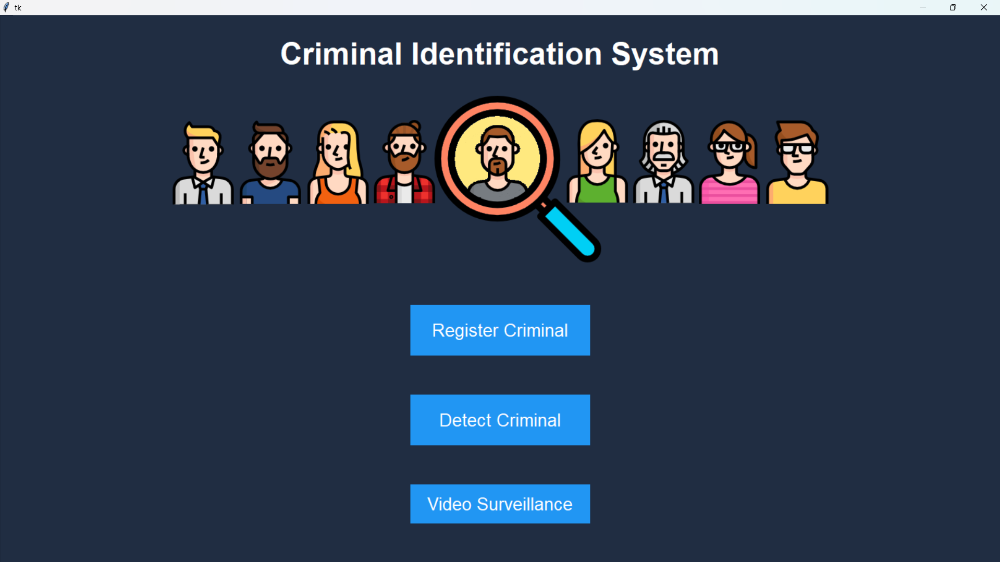

# Criminal Face Identification System

A comprehensive desktop application built with Python and OpenCV for criminal identification using face recognition technology. The system allows law enforcement agencies to register criminals and detect them in real-time from images or video feeds.

> **⚠️ Important Note**: All faces used in this project are AI-generated faces created for demonstration and testing purposes. No real human faces or personal data have been used as samples in this system.

## 🚀 Features

### Core Functionality
- **Criminal Registration**: Register new criminals with multiple face images and detailed information
- **Face Detection**: Detect criminals from uploaded images using advanced face recognition
- **Real-time Video Surveillance**: Live camera feed with instant criminal identification
- **Profile Management**: View detailed criminal profiles with photos and information
- **Database Integration**: MySQL database for storing criminal records

### Technical Features
- **Advanced Face Recognition**: Custom nearest-neighbor algorithm with cosine similarity
- **Pose Robustness**: Handles front and side profile images
- **Adaptive Thresholds**: Per-person recognition thresholds for improved accuracy
- **Image Preprocessing**: Histogram equalization and L2 normalization
- **Multi-image Training**: Uses multiple face samples per person for better recognition

## 📸 Application Screenshots

### 1. Home Page

*Main interface with navigation to all system features - Register Criminal, Detect Criminal, and Video Surveillance*

## 🛠️ Installation & Setup

### Prerequisites
- Python 3.8 or higher
- MySQL Server
- Webcam (for video surveillance)

### Required Python Packages
```bash
pip install opencv-python==4.9.0.80
pip install opencv-contrib-python==4.9.0.80  # For LBPH face recognition
pip install numpy==1.26.3
pip install pillow==10.2.0
pip install pymysql==1.1.0
pip install tkinter  # Usually comes with Python
```

### Database Setup
1. Create MySQL database:
```sql
CREATE DATABASE cfis;
```

2. Create the criminal data table:
```sql
CREATE TABLE criminaldata(
    id int primary key auto_increment,
    `name` varchar(20) not null,
    `father name` varchar(25),
    `mother name` varchar(25),
    gender varchar(6) not null,
    dob varchar(10),
    `blood group` varchar(5),
    `identity mark` varchar(30) not null,
    nationality varchar(15) not null,
    `religion` varchar(15) not null,
    `crimes` text not null
);
```

3. Update database credentials in `dbHandler.py`:
```python
# Update these values in dbHandler.py
host='localhost'
user='root'
password='your_password'
database='cfis'
```

## 🚀 Running the Application

1. Navigate to the project directory:
```bash
cd criminal_face_identification_system/CFIS/CFIS/project/project/
```

2. Run the main application:
```bash
python home.py
```

## 📁 Project Structure

```
criminal_face_identification_system/
├── CFIS/
│   └── CFIS/
│       └── project/
│           └── project/
│               ├── home.py              # Main application file
│               ├── facerec.py            # Face recognition algorithms
│               ├── register.py          # Criminal registration logic
│               ├── dbHandler.py         # Database operations
│               ├── face_cascade.xml     # Haar cascade for face detection
│               ├── face_samples/        # Training face images
│               │   └── [criminal_name]/
│               │       ├── 1.png
│               │       ├── 2.png
│               │       └── ...
│               ├── profile_pics/        # Criminal profile photos
│               │   ├── criminal 1.png
│               │   ├── criminal 2.png
│               │   └── ...
│               └── assets/              # UI images
│                   ├── logo.png
│                   ├── back.png
│                   ├── previous.png
│                   └── next.png
└── README.md
```

## 🔧 How It Works

### 1. Criminal Registration
- Upload 5+ face images of the criminal
- Fill in personal details (name, gender, identification marks, etc.)
- System processes and stores face samples
- Creates training data for recognition

### 2. Face Recognition Process
- **Face Detection**: Uses Haar Cascade to detect faces in images
- **Preprocessing**: Histogram equalization and L2 normalization
- **Feature Extraction**: Converts faces to normalized feature vectors
- **Recognition**: Cosine similarity matching against stored templates
- **Adaptive Thresholds**: Per-person recognition thresholds

### 3. Detection Modes
- **Image Detection**: Upload and analyze single images
- **Video Surveillance**: Real-time camera feed analysis
- **Profile Viewing**: Click on detected names to view full profiles

## ⚙️ Configuration

### Recognition Parameters
You can adjust recognition sensitivity in `facerec.py`:

```python
# Global similarity threshold (0.0 to 1.0)
SIM_THRESHOLD = 0.6

# Margin between best and second-best match
MARGIN_THRESHOLD = 0.02
```

### Camera Settings
For video surveillance, the system uses camera index 0 by default. Modify in `home.py`:
```python
webcam = cv2.VideoCapture(0)  # Change index if needed
```

## 🐛 Troubleshooting

### Common Issues

1. **"No criminal recognized"**
   - Ensure good lighting and clear face visibility
   - Check if person is properly registered
   - Try adjusting similarity threshold

2. **Camera not working**
   - Verify camera permissions
   - Check camera index (try 0, 1, 2)
   - Ensure no other applications are using the camera

3. **Database connection errors**
   - Verify MySQL is running
   - Check database credentials in `dbHandler.py`
   - Ensure database and table exist

4. **Face detection issues**
   - Ensure `face_cascade.xml` is in the correct location
   - Check image quality and face size
   - Try different lighting conditions

## 📊 Performance Tips

- **Training Data**: Use 5-10 diverse face images per person
- **Image Quality**: Ensure clear, well-lit photos
- **Pose Variety**: Include front and side profile images
- **Regular Updates**: Retrain when adding new criminals

## 🔒 Security Considerations

- Store database credentials securely
- Implement user authentication for production use
- Encrypt sensitive criminal data
- Regular backup of database and face samples

## 📝 License

This project is for educational and law enforcement purposes. Please ensure compliance with local privacy laws and regulations.

## 🤝 Contributing

1. Fork the repository
2. Create a feature branch
3. Make your changes
4. Test thoroughly
5. Submit a pull request

## 📞 Support

For technical support or questions about implementation, please refer to the code documentation or create an issue in the repository.

---

**Note**: This system is designed for legitimate law enforcement use. Ensure proper authorization and compliance with applicable laws before deployment.
