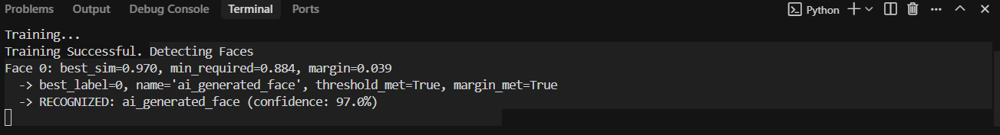

# Criminal Face Identification System

A comprehensive desktop application built with Python and OpenCV for criminal identification using face recognition technology. The system allows law enforcement agencies to register criminals and detect them in real-time from images or video feeds.

> **⚠️ Important Note**: All faces used in this project are AI-generated faces created for demonstration and testing purposes. No real human faces or personal data have been used as samples in this system.

## 🚀 Features

### Core Functionality
- **Criminal Registration**: Register new criminals with multiple face images and detailed information
- **Face Detection**: Detect criminals from uploaded images using advanced face recognition
- **Real-time Video Surveillance**: Live camera feed with instant criminal identification
- **Profile Management**: View detailed criminal profiles with photos and information
- **Database Integration**: MySQL database for storing criminal records

### Technical Features
- **Advanced Face Recognition**: Custom nearest-neighbor algorithm with cosine similarity
- **Pose Robustness**: Handles front and side profile images
- **Adaptive Thresholds**: Per-person recognition thresholds for improved accuracy
- **Image Preprocessing**: Histogram equalization and L2 normalization
- **Multi-image Training**: Uses multiple face samples per person for better recognition

## 📸 Application Screenshots

### 1. Home Page

*Main interface with navigation to all system features - Register Criminal, Detect Criminal, and Video Surveillance*

### 2. Register Criminal

*Interface for registering new criminals with multiple face images and detailed information*

### 3. Detect Criminal

*Face detection and recognition from uploaded images with bounding boxes*

### 4. Criminal Profile

*Detailed criminal profile view with photo and personal information*

### 5. Video Surveillance

*Real-time camera feed with live criminal identification*

### 6. Terminal Output

*System terminal showing application logs and status*

## 🛠️ Installation & Setup

### Prerequisites
- Python 3.8 or higher
- MySQL Server
- Webcam (for video surveillance)

### Required Python Packages
```bash
pip install opencv-python==4.9.0.80
pip install opencv-contrib-python==4.9.0.80  # For LBPH face recognition
pip install numpy==1.26.3
pip install pillow==10.2.0
pip install pymysql==1.1.0
pip install tkinter  # Usually comes with Python
```

### Database Setup
1. Create MySQL database:
```sql
CREATE DATABASE cfis;
```

2. Create the criminal data table:
```sql
CREATE TABLE criminaldata(
    id int primary key auto_increment,
    `name` varchar(20) not null,
    `father name` varchar(25),
    `mother name` varchar(25),
    gender varchar(6) not null,
    dob varchar(10),
    `blood group` varchar(5),
    `identity mark` varchar(30) not null,
    nationality varchar(15) not null,
    `religion` varchar(15) not null,
    `crimes` text not null
);
```

3. Update database credentials in `dbHandler.py`:
```python
# Update these values in dbHandler.py
host='localhost'
user='root'
password='your_password'
database='cfis'
```

## 🚀 Running the Application

1. Navigate to the project directory:
```bash
cd criminal_face_identification_system/CFIS/CFIS/project/project/
```

2. Run the main application:
```bash
python home.py
```

## 📁 Project Structure

```
criminal_face_identification_system/
├── CFIS/
│   └── CFIS/
│       └── project/
│           └── project/
│               ├── home.py              # Main application file
│               ├── facerec.py            # Face recognition algorithms
│               ├── register.py          # Criminal registration logic
│               ├── dbHandler.py         # Database operations
│               ├── face_cascade.xml     # Haar cascade for face detection
│               ├── face_samples/        # Training face images
│               │   └── [criminal_name]/
│               │       ├── 1.png
│               │       ├── 2.png
│               │       └── ...
│               ├── profile_pics/        # Criminal profile photos
│               │   ├── criminal 1.png
│               │   ├── criminal 2.png
│               │   └── ...
│               └── assets/              # UI images
│                   ├── logo.png
│                   ├── back.png
│                   ├── previous.png
│                   └── next.png
└── README.md
```

## 🔧 How It Works

### 1. Criminal Registration
- Upload 5+ face images of the criminal
- Fill in personal details (name, gender, identification marks, etc.)
- System processes and stores face samples
- Creates training data for recognition

### 2. Face Recognition Process
- **Face Detection**: Uses Haar Cascade to detect faces in images
- **Preprocessing**: Histogram equalization and L2 normalization
- **Feature Extraction**: Converts faces to normalized feature vectors
- **Recognition**: Cosine similarity matching against stored templates
- **Adaptive Thresholds**: Per-person recognition thresholds

### 3. Detection Modes
- **Image Detection**: Upload and analyze single images
- **Video Surveillance**: Real-time camera feed analysis
- **Profile Viewing**: Click on detected names to view full profiles

## 🔄 System Workflow

### Overall Project Flow

The Criminal Face Identification System follows a comprehensive workflow that can be divided into three main phases:

#### Phase 1: System Setup & Criminal Registration
```
1. Database Setup
   ├── Create MySQL database 'cfis'
   ├── Create criminaldata table
   └── Configure database credentials

2. Application Launch
   ├── Run home.py
   ├── Initialize face recognition system
   └── Load existing criminal data

3. Criminal Registration Process
   ├── Navigate to "Register Criminal"
   ├── Upload 5+ face images
   ├── Fill personal details form
   ├── Process and store face samples
   ├── Generate face embeddings
   ├── Save to database
   └── Create training data for recognition
```

#### Phase 2: Face Recognition & Detection
```
4. Face Recognition Pipeline
   ├── Input: Image/Video frame
   ├── Face Detection (Haar Cascade)
   ├── Image Preprocessing
   │   ├── Histogram equalization
   │   └── L2 normalization
   ├── Feature Extraction
   ├── Similarity Matching
   │   ├── Cosine similarity calculation
   │   ├── Threshold comparison
   │   └── Margin validation
   └── Output: Criminal identification

5. Detection Modes
   ├── Static Image Detection
   │   ├── Upload image
   │   ├── Process frame
   │   ├── Draw bounding boxes
   │   └── Display results
   └── Real-time Video Surveillance
       ├── Capture camera feed
       ├── Process each frame
       ├── Live identification
       └── Continuous monitoring
```

#### Phase 3: Results & Profile Management
```
6. Result Processing
   ├── Display detected criminal names
   ├── Show confidence scores
   ├── Draw bounding boxes around faces
   └── Provide clickable links to profiles

7. Profile Management
   ├── View criminal details
   ├── Display stored photos
   ├── Show personal information
   └── Access crime history
```

### Detailed Workflow Steps

#### Step-by-Step Process Flow:

1. **System Initialization**
   - Load face cascade classifier
   - Initialize database connection
   - Load existing criminal data
   - Prepare recognition models

2. **Criminal Registration Workflow**
   ```
   User Action → Upload Images → Form Filling → Image Processing → Database Storage → Training Data Creation
   ```

3. **Face Detection Workflow**
   ```
   Input Image → Face Detection → Preprocessing → Feature Extraction → Similarity Matching → Result Display
   ```

4. **Real-time Surveillance Workflow**
   ```
   Camera Feed → Frame Capture → Face Detection → Recognition → Live Display → Continuous Loop
   ```

5. **Profile Access Workflow**
   ```
   Detection Result → User Click → Profile Retrieval → Database Query → Information Display
   ```

### Data Flow Architecture

```
┌─────────────────┐    ┌──────────────────┐    ┌─────────────────┐
│   Input Source  │───▶│  Face Detection  │───▶│  Preprocessing  │
│ (Image/Video)   │    │  (Haar Cascade)  │    │  & Normalization│
└─────────────────┘    └──────────────────┘    └─────────────────┘
                                                         │
┌─────────────────┐    ┌──────────────────┐    ┌─────────────────┐
│   Database      │◀───│   Recognition    │◀───│ Feature Extraction│
│   Storage       │    │   Algorithm      │    │   & Matching    │
└─────────────────┘    └──────────────────┘    └─────────────────┘
         │                       │
         ▼                       ▼
┌─────────────────┐    ┌──────────────────┐
│ Criminal Data   │    │  Result Display   │
│ & Profiles      │    │  & Bounding Boxes│
└─────────────────┘    └──────────────────┘
```

### Key Workflow Components

- **Registration Flow**: Multi-step process ensuring data integrity
- **Recognition Flow**: Real-time processing with adaptive thresholds
- **Database Flow**: Seamless data storage and retrieval
- **UI Flow**: Intuitive user interface with clear navigation
- **Error Handling**: Robust error management throughout the workflow

This workflow ensures efficient criminal identification while maintaining data accuracy and system reliability.

## ⚙️ Configuration

### Recognition Parameters
You can adjust recognition sensitivity in `facerec.py`:

```python
# Global similarity threshold (0.0 to 1.0)
SIM_THRESHOLD = 0.6

# Margin between best and second-best match
MARGIN_THRESHOLD = 0.02
```

### Camera Settings
For video surveillance, the system uses camera index 0 by default. Modify in `home.py`:
```python
webcam = cv2.VideoCapture(0)  # Change index if needed
```

## 🐛 Troubleshooting

### Common Issues

1. **"No criminal recognized"**
   - Ensure good lighting and clear face visibility
   - Check if person is properly registered
   - Try adjusting similarity threshold

2. **Camera not working**
   - Verify camera permissions
   - Check camera index (try 0, 1, 2)
   - Ensure no other applications are using the camera

3. **Database connection errors**
   - Verify MySQL is running
   - Check database credentials in `dbHandler.py`
   - Ensure database and table exist

4. **Face detection issues**
   - Ensure `face_cascade.xml` is in the correct location
   - Check image quality and face size
   - Try different lighting conditions

## 📊 Performance Tips

- **Training Data**: Use 5-10 diverse face images per person
- **Image Quality**: Ensure clear, well-lit photos
- **Pose Variety**: Include front and side profile images
- **Regular Updates**: Retrain when adding new criminals

## 🔒 Security Considerations

- Store database credentials securely
- Implement user authentication for production use
- Encrypt sensitive criminal data
- Regular backup of database and face samples

## 📝 License & Acknowledgments

### License
This project is for educational and law enforcement purposes. Please ensure compliance with local privacy laws and regulations.

### 🏆 Credits & Acknowledgments

This Criminal Face Identification System was built using various open-source technologies, libraries, and models. We extend our sincere gratitude to the developers and contributors of the following technologies:

#### Core Technologies & Libraries

**OpenCV (Open Source Computer Vision Library)**
- **Version**: 4.9.0.80
- **Purpose**: Face detection, image processing, and computer vision operations
- **Credits**: OpenCV team and contributors
- **License**: Apache 2.0 License
- **Website**: https://opencv.org/

**NumPy (Numerical Python)**
- **Version**: 1.26.3
- **Purpose**: Mathematical operations and array processing for face recognition algorithms
- **Credits**: NumPy development team
- **License**: BSD License
- **Website**: https://numpy.org/

**PIL (Python Imaging Library) / Pillow**
- **Version**: 10.2.0
- **Purpose**: Image manipulation and processing
- **Credits**: Pillow development team
- **License**: HPND License
- **Website**: https://pillow.readthedocs.io/

**PyMySQL**
- **Version**: 1.1.0
- **Purpose**: MySQL database connectivity and operations
- **Credits**: PyMySQL contributors
- **License**: MIT License
- **Website**: https://github.com/PyMySQL/PyMySQL

**Tkinter**
- **Purpose**: GUI framework for the desktop application
- **Credits**: Python Software Foundation
- **License**: Python Software Foundation License
- **Website**: https://docs.python.org/3/library/tkinter.html

#### Face Recognition Models & Algorithms

**Haar Cascade Classifier**
- **Model**: face_cascade.xml
- **Purpose**: Face detection in images and video streams
- **Credits**: OpenCV team and Viola-Jones algorithm developers
- **Algorithm**: Viola-Jones object detection framework
- **Reference**: Viola, P., & Jones, M. (2001). Rapid object detection using a boosted cascade of simple features

**LBPH (Local Binary Patterns Histograms) Face Recognizer**
- **Purpose**: Face recognition and feature extraction
- **Credits**: OpenCV implementation of LBPH algorithm
- **Algorithm**: Local Binary Patterns for texture classification
- **Reference**: Ahonen, T., Hadid, A., & Pietikäinen, M. (2004). Face recognition with local binary patterns

**Cosine Similarity Algorithm**
- **Purpose**: Face matching and similarity calculation
- **Credits**: Mathematical concept implementation for face recognition
- **Algorithm**: Cosine similarity for vector comparison

#### Database Technology

**MySQL Database**
- **Purpose**: Criminal data storage and management
- **Credits**: Oracle Corporation and MySQL development team
- **License**: GPL v2.0 / Commercial License
- **Website**: https://www.mysql.com/

#### Development Tools & Frameworks

**Python Programming Language**
- **Version**: 3.8+
- **Purpose**: Core programming language
- **Credits**: Python Software Foundation
- **License**: Python Software Foundation License
- **Website**: https://www.python.org/

#### Special Acknowledgments

**AI-Generated Face Dataset**
- **Purpose**: Training and testing data for demonstration
- **Note**: All faces used in this project are AI-generated for educational purposes
- **Ethics**: No real human faces or personal data were used

**Open Source Community**
- We thank the entire open-source community for providing these excellent tools and libraries
- Special thanks to all contributors who made these technologies freely available
- This project would not have been possible without the collective efforts of the open-source ecosystem

#### Educational Purpose Statement

This project is developed purely for educational and research purposes in the field of computer vision and face recognition technology. It demonstrates the practical application of various machine learning and computer vision techniques for law enforcement and security applications.

**Important Notes:**
- All technologies used are properly licensed for educational use
- No proprietary or copyrighted materials were used without permission
- The project follows ethical guidelines for face recognition technology
- All AI-generated faces are used solely for demonstration purposes

#### References & Further Reading

1. Viola, P., & Jones, M. (2001). Rapid object detection using a boosted cascade of simple features. CVPR.
2. Ahonen, T., Hadid, A., & Pietikäinen, M. (2004). Face recognition with local binary patterns. ECCV.
3. OpenCV Documentation: https://docs.opencv.org/
4. Python Documentation: https://docs.python.org/
5. MySQL Documentation: https://dev.mysql.com/doc/

---

**Disclaimer**: This project is for educational purposes only. Users are responsible for ensuring compliance with local privacy laws, data protection regulations, and ethical guidelines when implementing face recognition technology.

## 🤝 Contributing

1. Fork the repository
2. Create a feature branch
3. Make your changes
4. Test thoroughly
5. Submit a pull request

## 📞 Support

For technical support or questions about implementation, please refer to the code documentation or create an issue in the repository.

---

**Note**: This system is designed for legitimate law enforcement use. Ensure proper authorization and compliance with applicable laws before deployment.
